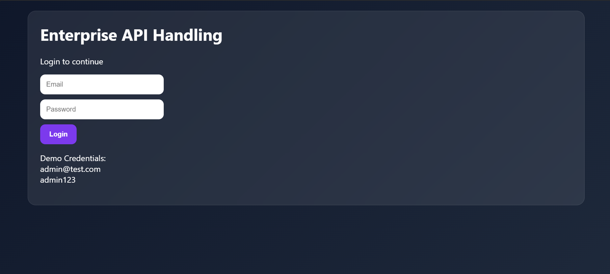
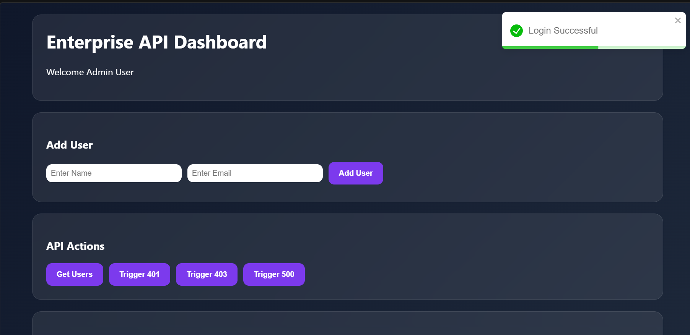
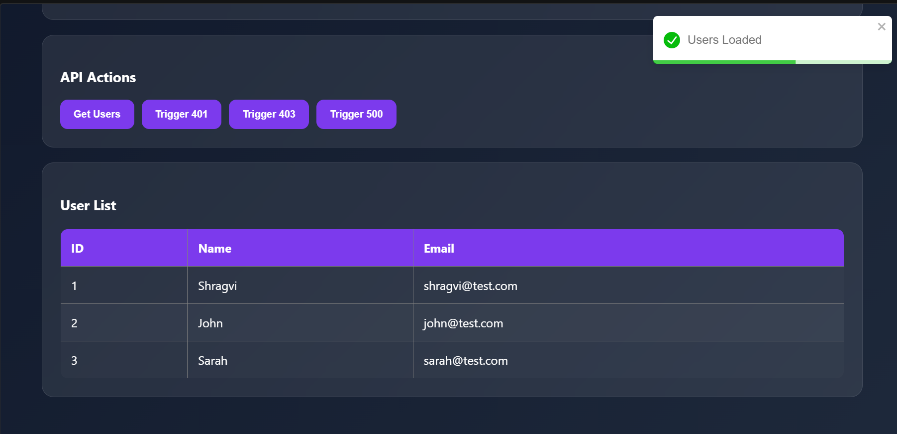
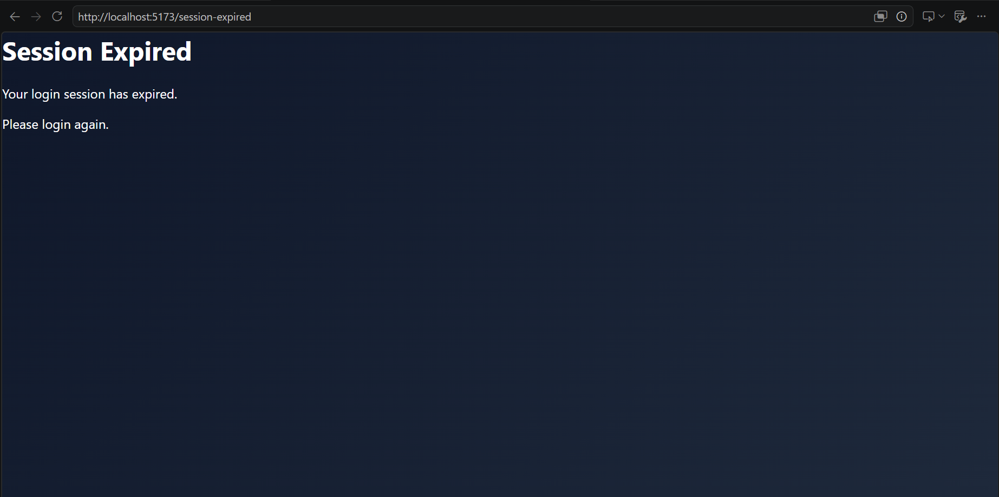
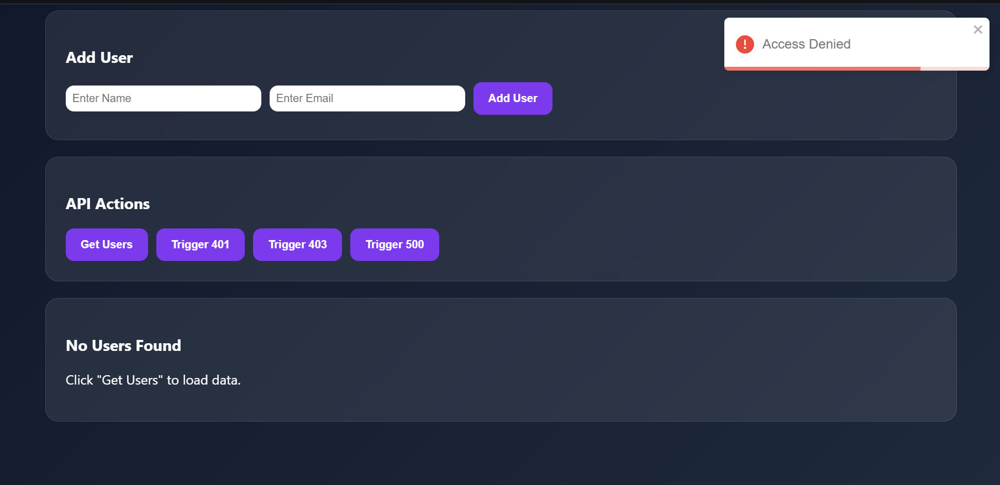
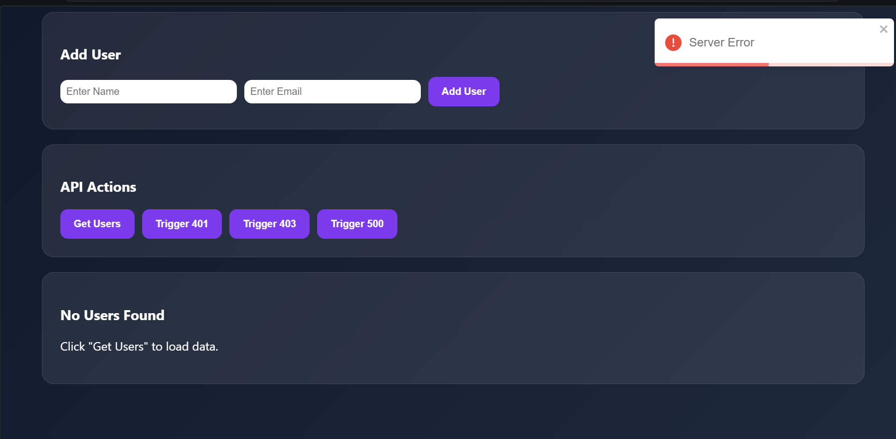

# Enterprise API Handling

## Overview

This project demonstrates enterprise-level API handling concepts using React and TypeScript.

The application includes:

* Centralized API architecture
* JWT token handling
* Global error handling
* Notification system
* Error boundaries
* Loading states
* Empty states
* Authentication workflow

---

## Features

### Enterprise API Handling

* Centralized API service layer
* Request and response handling
* Automatic JWT token management
* Session expiration handling
* Reusable API utilities

### Notifications

* Success notifications
* Error notifications
* Warning notifications
* Global notification provider

### Error Management

* Error Boundary implementation
* Global API error handling
* Unauthorized access handling
* Session expiration workflow

### UI Components

* Loading Skeleton
* Empty State Component
* Dashboard Page
* Login Page
* Session Expired Page

---

## Screenshots

### Login Page

### Dashboard

### Users Loaded

### 401 Unauthorized

### 403 Forbidden

### 500 Server Error

---

## Technologies Used

* React
* TypeScript
* Vite
* React Router DOM
* React Toastify

---

## Author

Shragvi Thopte
